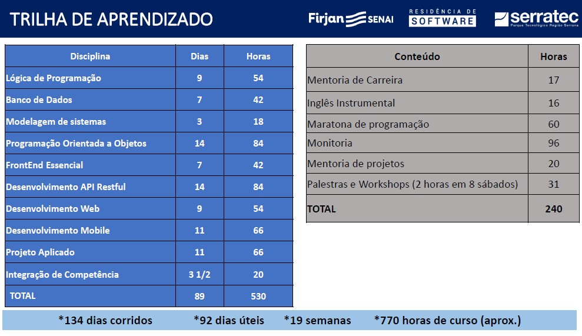

<a name="back-to-top">

  

<h1 align="center">Residência de Software</h1>
<h5 align="center">(Repositório completo)</h5>

##  Trilha de Aprendizado

✔️ [Lógica de Programação](serratec.LogicaDeProgramacao/) 
✔️ [Banco de Dados](serratec.BancoDeDados/) 
✔️ [Modelagem de Sistemas](serratec.ModelagemDeSistemas/) 
✔️ [Programação Orientada a Objetos](serratec.ProgramacaoOrientadaobjetos/) 
✔️ [Front-end Essencial](serratec.FrontEndEssencial/) 
✔️ [Desenvolvimento API Restful](serratec.desenvolvimentoAPI-Restful/) 
✔️ [Desenvolvimento Web](serratec.developmentWeb/) 
✔️ [Desenvolvimento Mobile](serratec.DevelopmentMobile/) 
❌ [Projeto Aplicado e Integração de Competência]() 
✔️ [Mentoria de Carreira](#) 
✔️ [Inglês Instrumental](serratec.Ingles/) 
❌ <s>Maratona de Programação</s> 
❌ <s>Mentoria de Projetos</s> 
✔️ [Palestras e Workshops](serratec.PalestrasWorkshops/)

*Totalizando 770h*

 
  
### 

 Trilha de Aprendizado Detalhada

 

### 

 Material Serratec Completo

 [Trilha de Aprendizado Completo PDF](assets/conteudo_programatico_residencia_software2021.1.pdf)

 

##  Tecnologia Utilizada

- [**HTML5**](https://html.spec.whatwg.org/)    [(*Documentação MDN*)](https://developer.mozilla.org/pt-BR/docs/Web/HTML)
- [**CSS**](https://www.w3.org/Style/CSS/)    [(*Documentação MDN*)](https://developer.mozilla.org/en-US/docs/Web/CSS/Reference)
- [**JavaScript**](https://www.javascript.com/)    [(*Documentação MDN*)](https://developer.mozilla.org/pt-BR/docs/Web/JavaScript)
- [**Java**](https://www.oracle.com/java/technologies/)    [(*Documentação*)](https://docs.oracle.com/en/java/)    [(*Documentação MDN*)](https://developer.mozilla.org/en-US/docs/Glossary/Java)
- [**React**](https://reactjs.org/)    [(*Documentação*)](https://reactjs.org/tutorial/tutorial.html)    [(*Documentação MDN*)](https://developer.mozilla.org/pt-BR/docs/Learn/Tools_and_testing/Client-side_JavaScript_frameworks/React_getting_started)
- [**React Native**](https://reactnative.dev/)    [(*Documentação*)](https://reactnative.dev/)    [(*Documentação MDN*)](https://developer.mozilla.org/pt-BR/docs/Learn/Tools_and_testing/Client-side_JavaScript_frameworks/React_getting_started)
- [**PostgreSQL**](https://www.postgresql.org/)    [(*Documentação*)](http://pgdocptbr.sourceforge.net/pg80/index.html)
- [**DBeaver**](https://dbeaver.io/)    [(*Documentação*)](https://dbeaver.com/docs/wiki/)
- [**Visual Studio Code**](https://code.visualstudio.com/)    [*(Documentação)*](https://code.visualstudio.com/docs)
- [**Eclipse**](https://www.eclipse.org/downloads/)    [*(Documentação)*](https://help.eclipse.org/2021-03/index.jsp)
- [**Spring Boot**](https://spring.io/)    [(*Documentação*)](https://spring.io/projects/spring-boot)
- [**Spring Tools 4**](https://spring.io/tools)    [(*Documentação*)](https://github.com/spring-projects/sts4/wiki)
- [**Node**](https://nodejs.org/en/)    [(*Documentação*)](https://nodejs.org/en/docs/)
- [**npm**](https://www.npmjs.com/)    [(*Documentação*)](https://docs.npmjs.com/)      
- [**Postman**](https://www.postman.com/downloads/)    [(*Documentação*)](https://learning.postman.com/docs/getting-started/introduction/)
- [**Oracle JDK**](https://www.oracle.com/br/java/technologies/javase-downloads.html)    [*(Documentação)*](https://docs.oracle.com/en/java/javase/16/)
- [**UML Designer**](http://www.umldesigner.org/)    [*(Documentação)*](http://www.umldesigner.org/ref-doc/presentation.html)
- [**Draw.io**](https://drawio-app.com/product/)    [*(Documentação)*](https://drawio-app.com/tutorials/)
- [**Portugol Studio**](https://portugol-webstudio.cubos.io/)    [*(Documentação)*](https://github.com/UNIVALI-LITE/Portugol-Studio/wiki/Como-funciona-o-Portugol-Studio)

 

   

<table>
  <tr>
    <td align="center">
      <a href="https://github.com/raiocodrigues">
         
        
          <b>Caio Rodrigues</b>
        
      </a>
    </td>
    <td align="center">
      <a href="https://github.com/FredericoStilpen">
         
        
          <b>Frederico Stilpen</b>
        
      </a> 
    </td>
    <td align="center">
      <a href="https://github.com/M4G1Ck">
         
        
          <b>Gabriel Macedo Araújo</b>
        
      </a> 
    </td>
    <td align="center">
      <a href="https://github.com/JpBade">
         
        
          <b>João Paulo Bade</b>
        
      </a> 
    </td>
    <td align="center">
      <a href="https://github.com/marcosbarker">
         
        
          <b>Marcos Paulo Marques Corrêa</b>
        
      </a> 
    </td>
    <td align="center">
      <a href="https://github.com/Volneineves">
         
        
          <b>Volnei Neves</b>
        
      </a> 
    </td>
</table>
 

&emsp;&emsp;&emsp;&emsp;&emsp;&emsp;&emsp;&emsp;&emsp;&emsp;&emsp;&emsp;&emsp;&emsp;&emsp;&emsp;&emsp;&emsp;&emsp;&emsp;⬆️[**Back to top**](#back-to-top)⬆️
